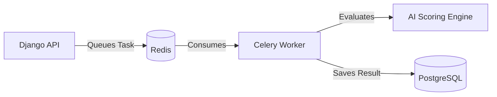

# ⚙️ SkillProof Backend API

*The core REST API and AI-Scoring engine powering the SkillProof platform.*

---

## 🌟 Overview

The SkillProof backend is built with **Django REST Framework** and handles everything from user authentication to complex AI-driven code evaluations. It utilizes **Celery** and **Redis** for asynchronous processing to ensure the API remains fast and non-blocking during heavy AI scoring tasks.

### 🔄 Asynchronous Task Flow

## 💻 Architecture Details
- **Core:** Python 3.11+
- **Framework:** Django REST Framework
- **Database:** PostgreSQL (via Supabase)
- **Async Queue:** Celery & Redis (via Upstash)
- **Transcription:** FFmpeg (for Whisper integration)

---

## 🚀 Getting Started

1. Install dependencies: `pip install -r requirements.txt`
2. Run migrations: `python manage.py migrate`
3. Start the server: `python manage.py runserver`

---

## 📄 License
This project is licensed under the [MIT License](../LICENSE).
