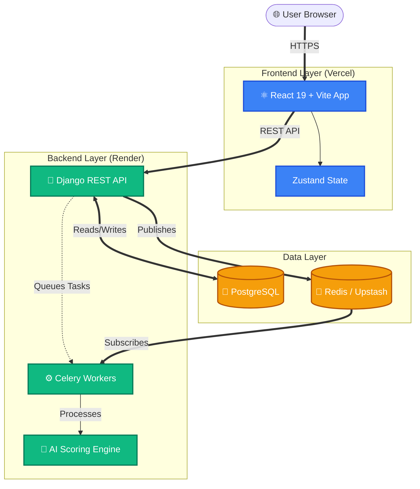
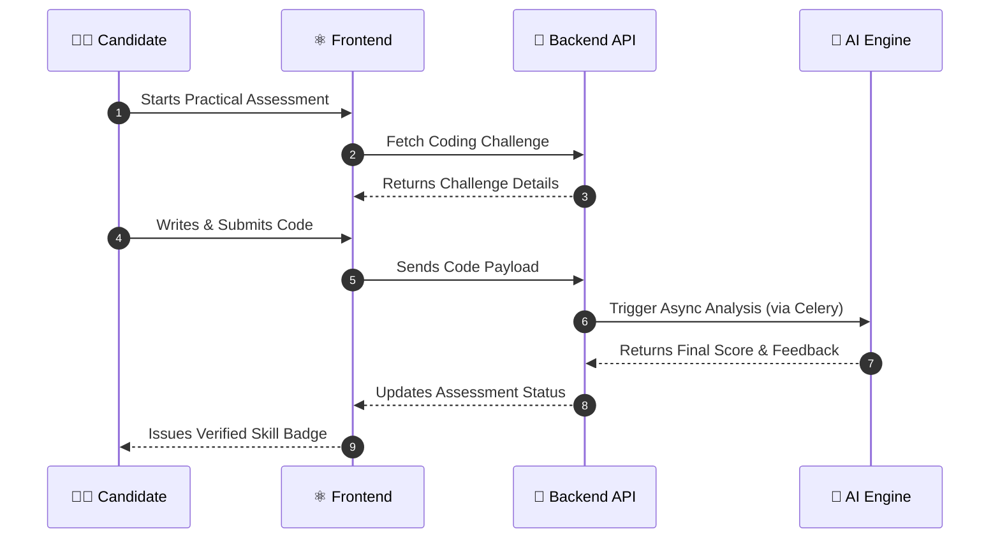

  
# 🚀 SkillProof

**An AI-Verified Practical Skill Portfolio Platform**

*Prove what you can do. Get verified credentials through AI-monitored practical tests.*

[Live Frontend (Vercel)](https://skillproof-eight.vercel.app) · [Backend API (Render)](https://skillproof-backend-3857.onrender.com)

---

## 📖 Table of Contents
- [About the Project](#-about-the-project)
- [Key Features](#-key-features)
- [System Architecture](#-system-architecture)
- [Tech Stack](#-tech-stack)
- [License](#-license)

---

## 🌟 About the Project

SkillProof bridges the gap between claims on a resume and actual capabilities. By utilizing advanced AI monitoring and real-time code evaluation, SkillProof provides an undeniable, cryptographically verified portfolio of a candidate's practical skills.

### 🎯 Why SkillProof?
- **For Candidates:** Stop relying on static resumes. Show actual proof of your coding abilities.
- **For Recruiters:** Hire with confidence knowing the candidate's skills are verified in a proctored environment.

---

## ✨ Key Features

- 🤖 **AI-Observed Assessments:** Real-time monitoring and scoring of practical tests.
- 📜 **Verified Portfolios:** Shareable, tamper-proof credentials for recruiters.
- 💻 **Live Code Evaluation:** Secure execution and semantic analysis of submitted code.
- 🎨 **Premium UI/UX:** Built with Framer Motion and Tailwind for a rich, dynamic experience.
- ⚡ **Asynchronous Processing:** Celery & Redis backed AI scoring for non-blocking operations.

---

## 🏗 System Architecture

The application follows a decoupled microservices-inspired architecture:

### 🔄 User Assessment Workflow

This sequence diagram illustrates how a candidate is evaluated in real-time:

---

## 💻 Tech Stack

<b>Frontend Details</b>

- **Core:** React 19, TypeScript, Vite
- **Styling:** Tailwind CSS 4, Framer Motion
- **State Management:** Zustand
- **Editor:** Monaco Editor (`@monaco-editor/react`)
- **Routing:** React Router v7
- **Deployment:** Vercel

<b>Backend Details</b>

- **Core:** Python 3.11+, Django, Django REST Framework
- **Database:** PostgreSQL (Production: Supabase) / SQLite (Local)
- **Background Tasks:** Celery, Redis (Production: Upstash)
- **Deployment:** Render

---

## 📄 License

This project is licensed under the [MIT License](LICENSE).

  Built with ❤️ by Ajay Vishwakarma

